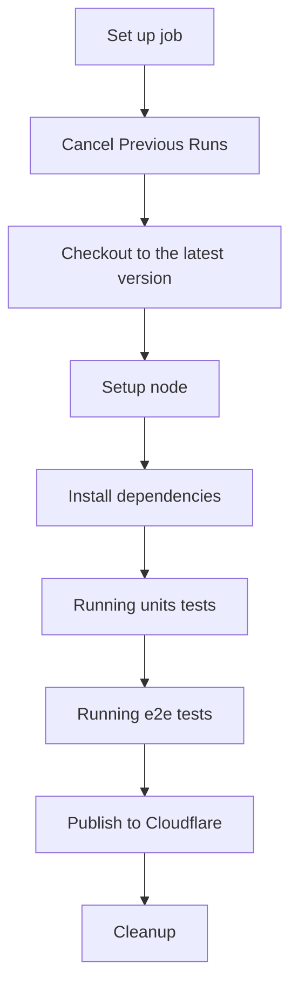
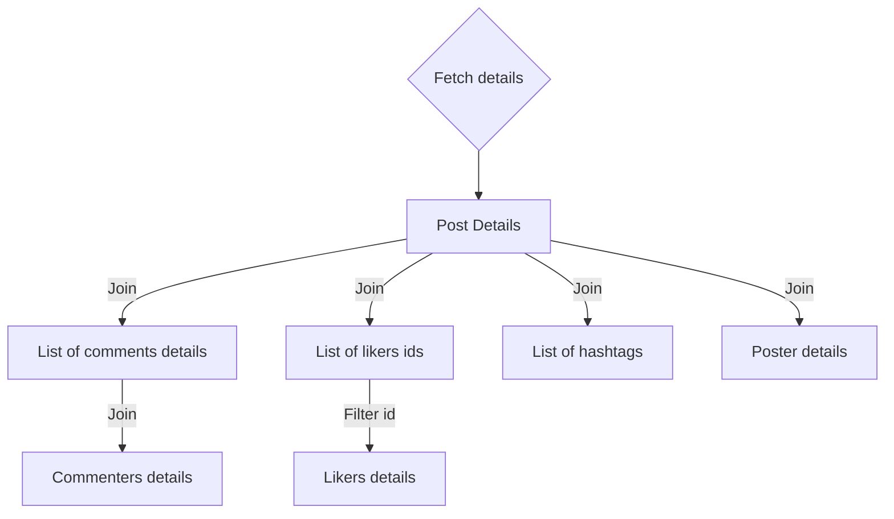
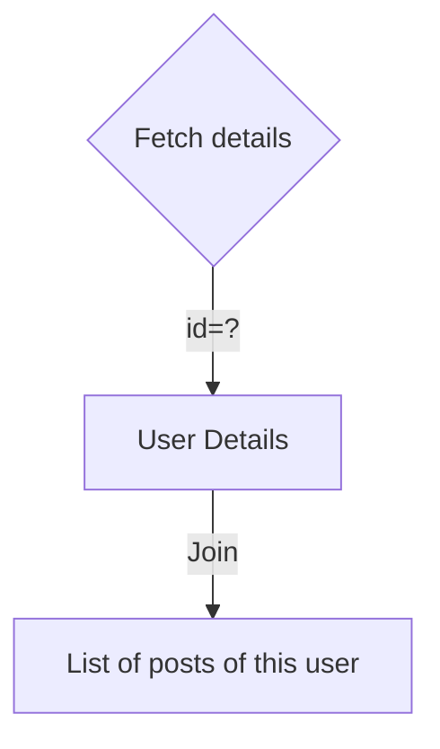

# Kuroco Social Network Web Application

This web application was developed using **Kuroco** technology, it's main purpose is to demonstrate the effiency of **Kuroco** in a web application.

## Technologies

### Back-End stacks

- Kuroco contents
- Kuroco api
- Kuroco files
- Kuroco activities
- Kuroco member
- Kuroco operations

### Front-End stacks

- Node js
- Remix js - _ontop of React_
- TypeScript
- Tailwind css
- Cypress
- Jest

### DevOps stacks

- Cloudflare workers
- Github CI

## Project building process

In order to recreate this project and run it on your local machine, please follow these steps and make sure to have npm installed on your pc.

1.  Install the dependencies
    `npm install`
    > Before moving to the next step, make sure you have configured your cloudflare account and you logged in from the cli (Check bellow).
2.  Open the project's folder and execute this command:
    `npm run start-server`

3.  _Congratulation_, you just launched your first Remix application.
    > Your project will be hosted locally at _http://localhost:8787_.

## Project testing process

This project contains Unit tests and E2E tests that are also executed in the CI workflow.

> We use React testing library alongside with Jest testing tool for Units tests.

- To run your unit tests, please execute this command:
  `npm run test`

> For E2E tests, we use cypress, you can install cypress on your local machine to watch the testing process live.

- To run E2E tests, please execute this command:
  `npm run e2e`

## Kuroco configuration

Please make sure you sign up to [Kuroco free trial](https://kuroco.app/free_trial/) program, after you verify your email address, please create a new content named `Posts` with title, content and image fields.

please open the api page and select `import api`, then upload the file `<rootDir>/exported_api.yaml`. Make sure to modify `topics_group_id` and `default_group_id` and match it with your model id and users group id.
[](https://diverta.gyazo.com/a67f7dd649b3ef26b2c4146a06ec25cb)
[](https://diverta.gyazo.com/af3a001cc0925c4377be42704fa79dcc)

Make sure you update the Host endpoint in `app/R.ts` file.

## Testing Api response

In order to test your new api, please use this [postman collection](https://www.getpostman.com/collections/7cd8473b5c2f4790c0d5) and modify the website subdomain so it links to your kuroco api.

You can also use Swagger UI available in your kuroco management panel.

[](https://diverta.gyazo.com/ff77d1774da065d0c7f3df2e3e9f9a95)

## Hosting configuration

This project is configured to be hosted on cloudflare as a worker, so please make sure you create a free cloudflare account and configure it as following.

1. Create your free Cloudflare account [here](https://dash.cloudflare.com/sign-up), after confirming your email address, create a worker service and link it to your repository.
2. Login to Cloudflare using npm wrangler, please execute this command to login:
   `wrangler login`
   You will be redirected to cloudflare website in order to confirm your credentials.
3. Run `wrangler dev` to launch the web app locally, or run `wrangler publish` to directly publish your modification to the Cloudflare service,
   > Please note that the CI process will automatically publish your modifications to the cloudflare service when you push an update to Github, please check `workflows/deploy` for the process of deploying, or check the section below for more information.

## Continuous integration

This project is configured to be directly published to a production environment when you push a modification to the `master` branch, the workflow `deploy` process will executes serval steps before publishing to Cloudflare.



1. First, it will cancel any running process so it won't get into a conflict.
2. Then, it will checkout the branch and install npm and the required dependencies.
3. It will run all units tests and e2e tests automatically.
   > Please note that if any test fails, the process will stop and the application will not be published.
4. Then, the workflow will publish your modifications to the Cloudflare service.
   > Please make sure to configure two secrets values in your github repository configuration, these values should be referenced by

```
secrets.CF_API_TOKEN
secrets.CF_ACCOUNT_ID
```

> You can find your account id in your Cloudflare account and your API token in your account settings.

## Kuroco Post processing functions

In order to keep our application fast and reliable, we are using **Kuroco** Post Processing functions to process the content of the posts, users and comments when they are fetched from the api.





## Project Structure

The main directory of this project is `<rootDir>/app`, if you want to add routes, components or services, you should add them in this directory.

    - `app/R.ts`: This file contains the main routes of the application.
    - `app/components/`: This directory contains the components of the application.
    - `app/services/`: This directory contains the services of the application.
    - `app/utils/`: This directory contains the utilities of the application.
    - `app/declarations/`: This directory contains the models of the application.
    - `app/hooks/`: This directory contains the state management hooks of the application.
    - `app/assets/`: This directory contains the assets of the application.
    - `app/router/`: This directory contains the router of the application.
    - `test/`: This directory contains the units tests of the application.
    - `cypress/`: This directory contains the e2e tests of the application.
    - `app/styles/`: This directory contains some designs used in the application, please note that this application use mainly Tailwind ofr the styling.

## Project configuration

This project is typed with typescript, units tests have a different configuration than e2e tests, we use differents configuration for the two types of tests in order to avoid conflicts between the two.